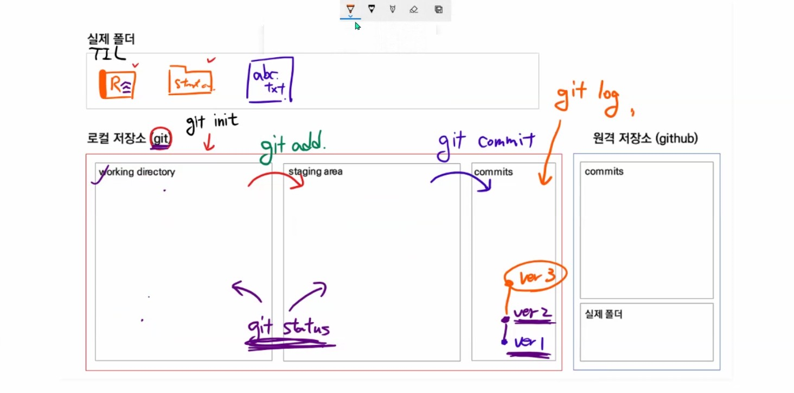

# Git 사용법

분산 버전 관리 시스템(DVCS, Distributed Version Control System)

소스코드의 버전을 관리하고 이력도 관리할 수 있다.


## 준비하기

1. 윈도우에 git을 설치한다. (git bash 설치)

2. 초기 설치 완료 후 로컬 컴퓨터에 `Author` 정보를 설정해야 한다.

   ```bash
   $ git config --global user.email 사용자이메일
   $ git config --global user.name 사용자이름
   $ git config --global -l		# 설정 값 확인
   ```


## 로컬 저장소

### 1. 저장소 초기화

```bash
$ git init
~/해당경로 (master)		// master명 확인으로 git 관리 여부 확인
```

- 이미 git으로 관리되는 폴더 내부에서 `git init` 하면 submodule로 등록되므로 주의
  - 해당 폴더로 찾아가서 `.git` 폴더 제거
  - Staging Area에 올라간 상태인 경우 : `git rm -rf --cached 폴더명`
  - CLI 환경에서 `(master)` 가 보이면 `git init` 을 하지 않는 게 좋다.

| Working Directory                                     | Staging Area (add)                                           | Local Repository (commit)                      |
| ----------------------------------------------------- | ------------------------------------------------------------ | ---------------------------------------------- |
| 실제 작업 공간<br/>변경점이 나타나면 이곳에 파일 등록 | commit 되기 전 임시로 파일들이 보여지는 곳<br/>commit 되어도 되는지 파일 확인 | git으로 관리되는 파일들의 버전들이 저장되는 곳 |




### 2. 상태 확인

```bash
$ git status		# WD, SA의 상태 확인
```

- Untracked
  - git으로 관리되지 않았던 파일이 새로 등록된 경우
  - WD에서 해당 단어를 확인할 수 있음
- Tracked
  - New file : git으로 관리되지 않았던 파일이 Staging Area에 등록된 경우
  - modified : git으로 관리되는데 수정된 파일이 Staging Area에 등록된 경우


### 3. gitignore

> 주의 : 제외할 파일을 먼저 gitignore에 등록 후 add
>
> 이미 add 되어 Staging Area에 등록된 경우 git으로 계속 관리됨
>
> Staging Area에서 제외하는 명령어
>
> ```bash
> $ git restore --staged 파일명
> ```

- 프로젝트과 관련 없는 파일을 등록하여 commit 되지 않도록 하는 것
  - 민감한 개인 파일
  - 개인 컴퓨터 설정 파일 (OS에서 활용되는 파일)
  - IDE 환경 설정 파일 (.idea/)
  - 가상환경 폴더 및 파일 (venv/)
- `.gitignore` 파일 생성 (확장자는 따로 없음)
  - 제외하고 싶은 파일 등록
  - 파일명을 적으면 끝
- Staging Area에 등록된 경우 (이미 add한 경우)
- [gitignore.io](https://gitignore.io/) 를 이용하면 편하게 gitignore 파일을 작성할 수 있음
  - 단, 개인적으로 생성한 파일은 직접 등록해야 함

### 4. Commit을 위한 준비

```bash
$ git add 파일명
$ git add .		// 현재 폴더 내 추가/변경된 파일 모두 등록
```

- Working Derectory에서 Staging Area로 관리 파일들을 이동시키는 명령어
- Staging Area에서 관리 대상에 대한 판단을 하고 commit 여부를 결정


### 5. Commit 하기

```bash
$ git commit -m "유의미한 내용으로 커밋 메시지 작성"
```

- 버전 이력을 확정짓는 명령어
- 해당 시점의 파일 변경된 내용을 스냅샷으로 기록해 남긴다. (변경된 부분만)


### 6. Commit 이력 확인하기

```bash
$ git log
$ git log --oneline		# 한 줄로 축약해 보여줌
$ git log -p			# 파일 변경 내용도 같이 보여줌
$ git log -숫자			# 숫자만큼 보여줌
```


## 원격 저장소 (Remote Repository)

- github / gitlab

### 1. 원격 저장소 등록

- 사용하기 위해서는 로컬에 원격  저장소의 url 주소를 등록해야 함

  ```bash
  $ git remote add 저장소별명(origin) 저장소주소
  ```

- 등록된 원격 저장소의 주소를 확인하는 방법

  ```bash
  $ git remote -v
  ```

- 저장소 삭제

  ```bash
  $ git remote rm 저장소별명
  ```


### 2. 원격 저장소에 commit 내용 보내기

- 로컬에 저장된 commit을 원격 저장소로 전달하여 분산 버전 관리를 완성하는 부분

  ```bash
  $ git push 저장소별명 브랜치명
  $ git push -u origin master
  ```

  - `-u` : --set-upstream의 shortcut 형태로 저장소 별명과 브랜치명을 설정


### 3. 원격 저장소에서 내려받기

- git clone
  - `git init`, `git remote add` 동작이 포함된 내려받기 명령어
  - 아무 것도 없는 상태일 때 사용
  - `git clone 저장소주소`
- git pull
  - remote 서버의 정보를 내려받는 명령어
  - git이 적용되어 있어야 한다. (.git 폴더가 존재해야 함)
  - remote 정보가 등록되어 있어야 한다.
  - `git pull 저장소별명 브랜치명`
